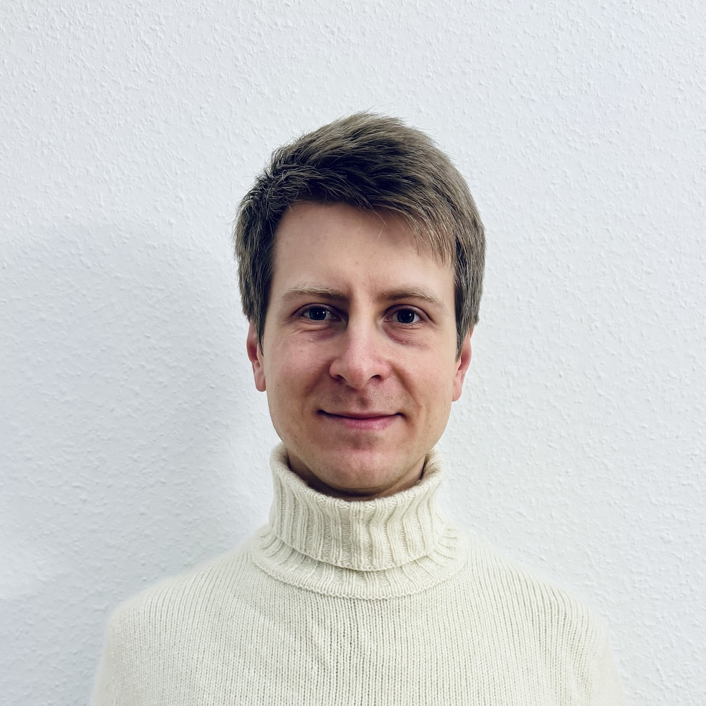

Hey, my name is **Alexey Kondratov**. I'm originally from Moscow, Russia, where I grew up, got my Master's degree in physics, defended my PhD, and [spent several years doing academic research](https://scholar.google.com/citations?user=WXJo9l0AAAAJ). After that, I participated in [2017 GSoC for the PostgreSQL organization](https://summerofcode.withgoogle.com/archive/2017/projects/6196688620355584) and finally decided to switch tracks in my career and focus on software development.

Nowadays, I live in Berlin, Germany, and work as a Lead Software Engineer at <https://neon.tech>, working on the compute part of serverless Postgres.

- 🐙 [github.com/ololobus](https://github.com/ololobus)
- 👨‍💻 [linkedin.com/in/alexeyko](https://www.linkedin.com/in/alexeyko)
- ✉️ [kondratov.aleksey@gmail.com](mailto:kondratov.aleksey@gmail.com)
- 📄 [PDF CV](alexey_kondratov_cv.pdf)

## Public talks

- **2025 PostgreSQL Berlin Meetup**: [Serverless Postgres: the journey from ~1s startup time to 10s and back again](https://andreas.scherbaum.la/post/2025-02-10_postgresql-berlin-february-2025-meetup/) --- [PDF slides](2025_Postgres_Meetup_Berlin.pdf)
- **2021 FOSDEM**: [Getting on a hook or PostgreSQL extensibility](https://archive.fosdem.org/2021/schedule/event/postgresql_extensibility/) --- [PDF slides](2021_fosdem_postgres_extensibility.pdf)
- **2020 PGCon**: [Ptrack 2.0: yet another block-level incremental backup engine](https://www.pgcon.org/2020/schedule/session/98-ptrack-20-yet-another-block-level-incremental-backup-engine/index.html) --- [PDF slides](2020_PGCon_ptrack.pdf)
